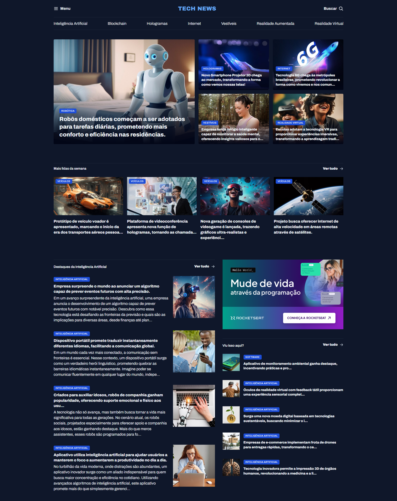

# 📰 Portal TechNews

Projeto de um portal de notícias focado em tecnologia, apresentando as últimas novidades sobre **Inteligência Artificial**, **Blockchain**, **Hologramas**, **Internet**, **Vestíveis**, **Realidade Aumentada** e **Realidade Virtual**. O site foi desenvolvido com design moderno, porém ainda não foi feito o responsivo, por não estar estudando isso ainda.

---

# 🔗 Acesse o Projeto Online

Você pode acessar o projeto diretamente pelo link abaixo:
👉 [Clique aqui para ver o projeto online](https://portal-de-noticias-rocketseat.vercel.app/)

---

## 🛠️ Como o Projeto Foi Feito

Este projeto foi construído com foco em criar uma interface moderna e intuitiva para um portal de notícias de tecnologia. A estrutura da página está organizada em seções bem definidas:

- **Header**: Navegação principal com menu, logo e busca, além de menu secundário com categorias
- **Seção Featured**: Destaque principal com notícias em evidência usando grid layout
- **Mais Lidas da Semana**: Lista das notícias mais populares
- **Destaques de IA**: Seção dedicada às notícias de Inteligência Artificial
- **Sidebar**: Área lateral com publicidade e seção "Viu isso aqui?"

O design utiliza CSS Grid como principal tecnologia, pois é o que foi estudado para criar layouts complexos, com tipografia moderna usando a fonte **Archivo** do Google Fonts. As imagens são otimizadas e organizadas por categorias com tags visuais.

---

## 🧠 Conceitos Trabalhados

- **HTML5** semântico
- **CSS3** avançado
  - CSS Grid Layout
  - Flexbox (bem pouco, não foi o foco dos estudos)
  - Tipografia customizada
  - Organização por componentes
- **Estruturação de conteúdo** jornalístico
- **UX/UI** para portais de notícias
- **Organização de assets** (imagens, ícones, estilos)

---

## 📱 Funcionalidades

- ✅ Navegação por categorias de tecnologia
- ✅ Seções organizadas por relevância
- ✅ Tags de categorização visual
- ✅ Design moderno e profissional
- ✅ Estrutura semântica otimizada

---

## 🎨 Categorias de Notícias

- 🤖 **Inteligência Artificial**
- ⛓️ **Blockchain**
- 👻 **Hologramas**
- 🌐 **Internet**
- ⌚ **Vestíveis**
- 🥽 **Realidade Aumentada**
- 🎮 **Realidade Virtual**
- 🚗 **Veículos**
- 💻 **Software**

---

## 🔍 Preview do Projeto



---

## 🧱 Tecnologias Utilizadas

- **HTML5**
- **CSS3**
- **Google Fonts** (Archivo)
- **SVG Icons**
- **CSS Grid & Flexbox**

---

## 📁 Estrutura do Projeto

```
portal-de-noticias-rocketseat/
├── index.html
├── styles/
│   └── index.css
├── assets/
│   ├── icons/
│   │   ├── Logo.svg
│   │   ├── List.svg
│   │   └── MagnifyingGlass.svg
│   └── images/
│       ├── Image01.png - Image18.png
│       └── Ads.png
└── README.md
```

---

## 🚀 Como Executar

1. Clone este repositório
2. Abra o arquivo `index.html` em seu navegador
3. Ou use um servidor local como Live Server (VS Code)

```bash
# Se usando um servidor local
npx serve .
# ou
python -m http.server 8000
```

---

## 📄 Licença

Este projeto está licenciado sob a [Licença MIT](https://opensource.org/licenses/MIT).  
Você pode usar, modificar e distribuir livremente. Criado para fins educacionais e prática em desenvolvimento web.

---

## 👨‍💻 Autor

Desenvolvido com 💜 por @eilincoln - Projeto focado em praticar layouts modernos e organização de conteúdo jornalístico.
